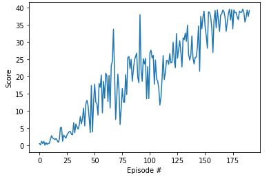

[image1]: single_agent_solved.png "Trained Agent"
[image2]: clipped_surrogate_function.png "Clipped surrogate function"
[image3]: hyperparameters_history.png "Hyper parameters history"

# Project 2: Continuous Control

### Introduction

This project trains a single agent to work with the Reacher environment (first version). The Reacher environment simulates the controlling of a double-jointed arm, to reach target locations.

#### The Environment
In this environment, a double-jointed arm can move to target locations. A reward of +0.1 is provided for each step that the agent's hand is in the goal location. Thus, the goal of the agent is to maintain its position at the target location for as many time steps as possible.

The observation space consists of 33 variables corresponding to position, rotation, velocity, and angular velocities of the arm. Each action is a vector with four numbers, corresponding to torque applicable to two joints. Every entry in the action vector should be a number between -1 and 1.

![Trained Agent][image1]

The task is episodic, and in order to solve the environment, the agent must get an average score of +30 over 100 consecutive episodes

### The Implementation

#### The Policy Neural Network

The Agent's Policy Neural Network consists of ActorNN:

    class ActorNN(nn.Module):
    
        def __init__(self, state_size, action_size):
            super(ActorNN, self).__init__()
            self.fc1 = nn.Linear(state_size, 256)
            self.fc2 = nn.Linear(256, 64)
            self.fc3 = nn.Linear(64, action_size)
            
    
        def forward(self, x):
            x = F.relu(self.fc1(x))
            x = F.relu(self.fc2(x))
            x = F.tanh(self.fc3(x))
            return x

CriticNN:

    class CriticNN(nn.Module):
    
        def __init__(self, state_size):
            super(CriticNN, self).__init__()
            self.fc1 = nn.Linear(state_size, 512)
            self.fc2 = nn.Linear(512, 256)
            self.fc3 = nn.Linear(256, 64)
            self.fc4 = nn.Linear(64, 1)
            
    
        def forward(self, x):
            x = F.relu(self.fc1(x))
            x = F.relu(self.fc2(x))
            x = F.relu(self.fc3(x))
            x = self.fc4(x)
            return x

and PolicyNN:

    class PolicyNN(nn.Module):
        
        def __init__(self, state_size, action_size):
            super(PolicyNN, self).__init__()
            self.actor_policy = ActorNN(state_size, action_size)
            self.critic_value = CriticNN(state_size)
            # for action sampling in buffer and action log probability calculation
            self.std = nn.Parameter(torch.ones(1, action_size))
            self.to(device)
    
        def forward(self, states, action=None):
            states = torch.Tensor(states)
            a = self.actor_policy(states)
            v = self.critic_value(states)
            
            dist = torch.distributions.Normal(a, self.std)
            if action is None: # action sampling
                action = dist.sample()
            log_prob = dist.log_prob(action)
            log_prob = torch.sum(log_prob, dim=1, keepdim=True)
            return action, log_prob, v

The Agent's Policy network returns:
 - action: the action based on ActorNN,
 - log_prob: log probability of the sampled action with respect to the ActorNN,
 - v: the value of the provided state according to the CriticNN.

The log_prob is calculated from Normal distribution with Standard deviation of 1. 

If the `action` is not provided (i.e. when filling Critic's memory) then it is sampled with some noise under current ActorNN policy.

In the early versions of the Agent I tried different Standard deviations with poor results (at first the Agent was not capable of solving the Environment and Standard deviation may not be the culprit).

The PolicyNN architecture was chosen purely from intuition and was not much experimented with. Here might be a lot of room for improvement.

#### The Agent

The Agent is initialized with Policy network (see above), the Environment, optimizer and hyperparameters.

For this Agent Adam optimizer was used (other optimizers were not tried).

The hyperparameters that Agent was able to solve the Environment are:

    hyperparameters = {
            'episode_count': 1500,
            'discount_rate': 0.99,
            'tau': 0.5,
            'gradient_clip': 15,
            'buffer_size': 3072,
            'optimization_epochs': 2,
            'ppo_clip': 0.2,
            'batch_size': 64,
            'adam_learning_rate': 3e-4,
            'adam_epsilon': 1e-4
        }

The most important part of the Agent is the `.step` method. 

In first part of this method the Agent fill Critic's buffer (size 3072 from hyperparameters) with samples according to current Policy Network.

Then the buffer is preprocessed for PyTorch and most importantly the Advantages are calculated:

            ...
            returns = rewards + hyperparameters['discount_rate'] * dones * returns
            # advantage calculation based on critic values
            td_error = rewards + hyperparameters['discount_rate'] * dones * next_value.detach() - value.detach() * dones
            advantages = advantages * hyperparameters['tau'] * hyperparameters['discount_rate'] * dones + td_error
            processed_buffer[i] = [states, actions, log_probs, returns, advantages]
            ...

 - returns are discounted with `hyperparameters['discount_rate']`
 - Critic estimates the `td_error` by comparing the estimated value (discounted) of the next state with the estimated value of the current state (plus the reward)
 - advantages are further discounted with 'discount_rate' and *crucially* with the 'tau'. The Environment was solved (in 285 Episode) when hyperparameter `'tau'` was lowered to the value of 0.5.

###### The Loss

The Agent's performance is optimized by minimizing surrogate Loss. In every optimization_epoch and in every batch the Agent updates PolicyNN weights according to this Loss.:

                _, log_probs, values = self.network(sampled_states, sampled_actions)
                ratio = (log_probs - sampled_log_probs).exp()
                obj = ratio * sampled_advantages
                obj_clipped = ratio.clamp(1.0 - hyperparameters['ppo_clip'],
                                          1.0 + hyperparameters['ppo_clip']) * sampled_advantages
                policy_loss = -torch.min(obj, obj_clipped).mean(0)

                value_loss = 0.5 * (sampled_returns - values).pow(2).mean()

                self.optimizer.zero_grad()
                (policy_loss + value_loss).backward()
                nn.utils.clip_grad_norm_(self.network.parameters(), hyperparameters['gradient_clip'])
                self.optimizer.step()

The `ratio` is calculated by comparing current log probability of the sampled action with the sampled log probability from Critic. This ratio is used for weighting the Critic's sampled advantage - the objective function before clipping. Then the minimum between the objective function and the clipped objective function is chosen.

![Clipped surrogate function][image2]

Furthermore, the 'value_loss' is calculated by squaring the difference between sampled_returns and values of the current Policy, then weighted with 0.5

Finally, the policy_loss (negative for the gradient ascent) and value_loss are summed together to calculate the gradient. 

### Achieved performance
The current implementation achieved desired performance (average score of last 100 episodes >= 30) in 285 Episodes of training (Note: each Episode consisted of 3072 steps in the environment i.e. 285x3072 steps were needed in the Environment). 

### Future improvements

The Agent could be improved in many ways:
* *faster training* - by tweaking Algorithm's hyper parameters (for example reducing buffer_size) Agent could achieve similar performance needing fewer steps in the Environment.
* implement *gpu* training (NVidia RTX 3090 has troubles with PyTorch 0.4.0 which requires Cuda version 8, but the GPU is not supported by Cuda 8)
* *better performance* - by training longer, increasing Replay Buffer, using more sophisticated Policy Network could improve Agent's Policy by achieving higher scores than threshold.
* by implementing other algorithms - DDPG, A3C, D4PG and others.
* it would be interesting to try implement the Attention mechanism for the Agent.

Note:
Before solving the Environment, the same hyper parameters took 1000 Episodes to reach 29.44 average_score of the last 100 Episodes (*last column):

